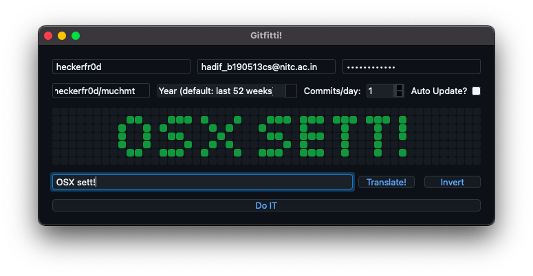

# GitHub Tile Art

A Qt C++ app to customize your GitHub contribution graph. Basically a C++ port of [this python GUI app](https://github.com/heckerfr0d/github-abuz).  
  
## Instructions

### Usage

  

The `auto-update` feature stores your designs for the `auto-update` script to automatically select and set one (from all your default year designs) on startup.  
**Warning:** Only do this on a dedicated repo as it will delete and recreate the repo. Only the commits made for other years with `Auto Update?` checked remain unaffected.  
The rest is pretty self-explanatory (I think :p).  
Username, password and email must be the ones corresponding to your github account.  
Link to repo must be the https link. 100% recommend creating a dedicated repo for this :p .  
You can make your design using the grid of checkboxes. You can also translate text directly to tile art. Current build only supports caps and some special characters :grimacing: .  
`Invert` behaves exactly as expected.  
You can select under which year you want your graffiti to appear. It defaults to the last 52 weeks which is what your profile page normally displays.  
Commits per day is, obviously, the number of commits you want the program to do per day. The tile gets darker according to this number.  
Once you're satisfied with the design (are we ever? :P), Just tell the app to `Do IT` and it will :relieved: .  
**Note:** Depending on the number of commits it may take some time and the app may appear to not respond but don't worry, it's just creating all those commits in the background :grin: .  

### Build

#### Pre-requisites

1. [libgit2-1.1.0](https://github.com/libgit2/libgit2). You can install it from your package manager if available (Ubuntu 21.04+) or you can [build](https://github.com/libgit2/libgit2#building-libgit2---using-cmake) it yourself.
2. qmake and qt6 libraries. Things will be much simpler if you install the whole [Qt6 open-source](https://www.qt.io/download-open-source) package.
3. A clone of this repo (duh :p).

Ok, now navigate to the cloned repo folder and open github-tile-art.pro using Qt Creator.  
Correct the path to libgit2 in github-tile-art.pro by replacing `$$PWD/../` with the path to your libgit2-1.1.0 folder.  
If you installed libgit2 using your package manager you can simply remove the `INCLUDEPATH` and `DEPENDPATH` lines and change the `LIBS` line to

```qml
LIBS += -lgit2
```

Once you've made whatever other changes you want to make, all you have to do is build and run using the Qt Creator GUI.  
That's it! You've successfully built the app. Deployment, on the other hand, is a whole other story. 🙃

### Deployment

There are just a lot of different ways to do this so I'm just gonna drop links for now. 😇  
[Deployment on Qt6](https://doc.qt.io/qt-6/deployment.html)  
[linuxdeployqt](https://github.com/probonopd/linuxdeployqt) to create appimages.  

## Credits ❤️

[@dumbmachine](https://github.com/DumbMachine) - [Original Idea](https://github.com/DumbMachine/GithubArt) 😁  
[@hanna13n](https://github.com/hanna13n) - Cross Platform Testing and [Linux Deployment](https://github.com/heckerfr0d/github-tile-art/releases/tag/v2.0-linux) 😎  
[@SinadShan](https://github.com/SinadShan) - Testing on fresh Ubuntu 20.04 😌  
[@HowardHinnant](https://github.com/HowardHinnant) - The [date algorithms](http://howardhinnant.github.io/date_algorithms.html) used in [calendar.h](https://github.com/heckerfr0d/github-tile-art/blob/main/headers/calendar.h)  
I made the C++ [font map](https://github.com/heckerfr0d/github-tile-art/blob/main/headers/font.h) by editing some python dictionary that I can't find now (I'm sorry 🥺).  
The dreaded yet invaluable Documentations ([Qt](https://doc.qt.io/qt-6/), [libgit2](https://libgit2.org/docs/), [linuxdeployqt](https://github.com/probonopd/linuxdeployqt)) 🤓  
The wonderful people on StackOverflow etc. ❤️  
Anyone else I've missed (sorry 🥺❤️)  

THANK YOU!! ❤️❤️  
