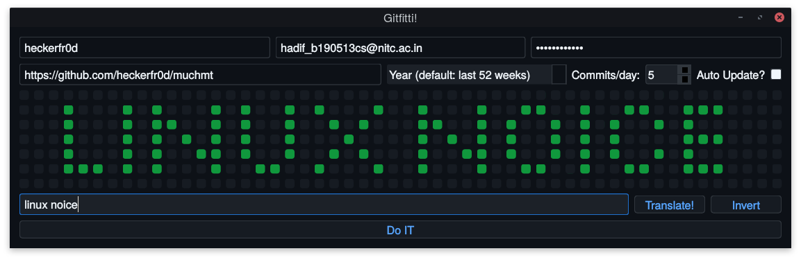

# GitHub Tile Art

A Qt C++ app to customize GitHub activity overview. Basically a C++ port of [this python GUI app](https://github.com/heckerfr0d/github-abuz).  
When pyinstaller stopped working for me (for some reason), I ported the app to C++ (dum, I know 🙂). I thought it'd be easy (so naive 🤦). It obviously wasn't but I couldn't leave it unfinished (yes, vattaan :p) so here it is :')  
  
## Usage

  

This part is pretty self-explanatory (I think :p).  
Username, password and email must be the ones corresponding to your github account.  
Link to repo must be the https link. 100% recommend creating a new repo for this :grin:  
You can make your design using the grid of checkboxes. You can also translate text directly to tile art. Current build only supports caps and some special characters :grimacing: .  
`Invert` behaves exactly as expected.  
You can select under which year you want your graffiti to appear. It defaults to the last 52 weeks which is what your profile page normally displays.  
Commits per day is, obviously, the number of commits you want the program to do per day. The tile gets darker according to this number.  
Once you're satisfied with the design (are we ever? :P), Just tell the app to `Do IT` and it will :relieved: .  
**Note:** Depending on the number of commits it may take some time and the app may appear to not respond but don't worry, it's just creating all those commits in the background :grin:  

## Build

README is still WIP, check back later for the build process 😁
